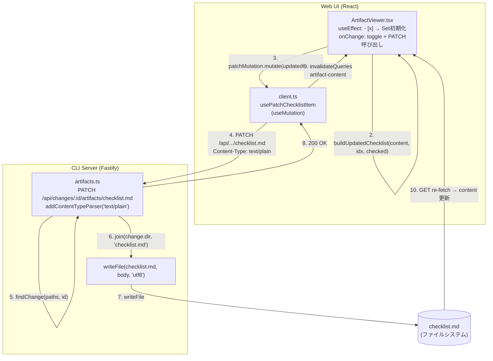
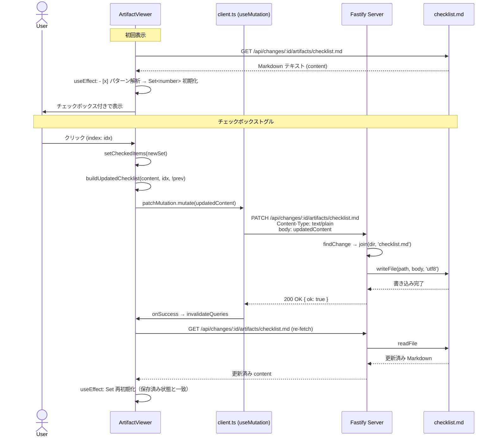
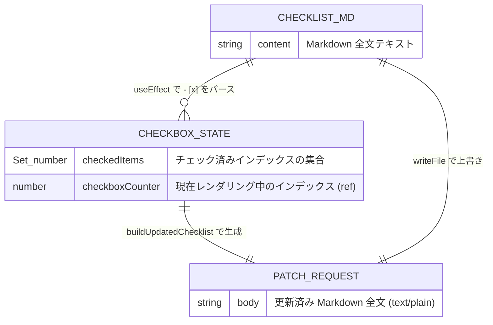

# Architecture Overview: fix-checklist-ui-sync

## System Diagram

---

## Sequence Diagram: チェックボックストグルの完全フロー

---

## Data Model: チェックボックス状態

---

## 変更ファイル一覧

| ファイル | 変更内容 |
|---------|---------|
| `packages/cli/src/server/routes/artifacts.ts` | `writeFile` import 追加 + PATCH ルート実装 |
| `packages/web-ui/src/api/client.ts` | `usePatchChecklistItem` mutation フック追加 |
| `packages/web-ui/src/components/ArtifactViewer.tsx` | `useEffect` 初期化 + `onChange` PATCH 呼び出し + `buildUpdatedChecklist` ヘルパー追加 |
| `packages/cli/src/server/__tests__/routes.artifacts.test.ts` | PATCH の正常・404・403 テストケース追加 |

---

## Constitution Check

| 原則 | Phase 0 | Phase 1 |
|------|---------|---------|
| I — ステップ独立性 | ✅ overview は design を参照するのみ | ✅ 実装詳細に依存しない |
| II — 決定論的マージ | ✅ | ✅ |
| III — 質問駆動の要件確定 | ✅ | ✅ |
| IV — 双方向アンカー | ✅ | ✅ |
| V — 強制/拡張ステップの分離 | ✅ | ✅ |
| VI — Security by Default | ✅ PATCH 対象を図中でも明示的に限定 | ✅ |

### Complexity Tracking

None
