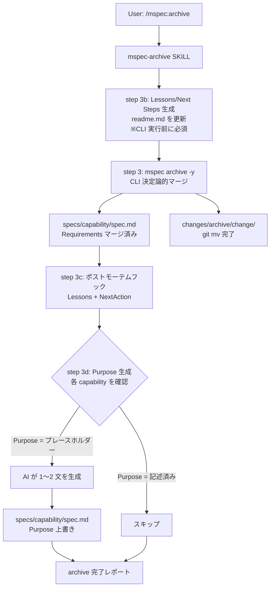
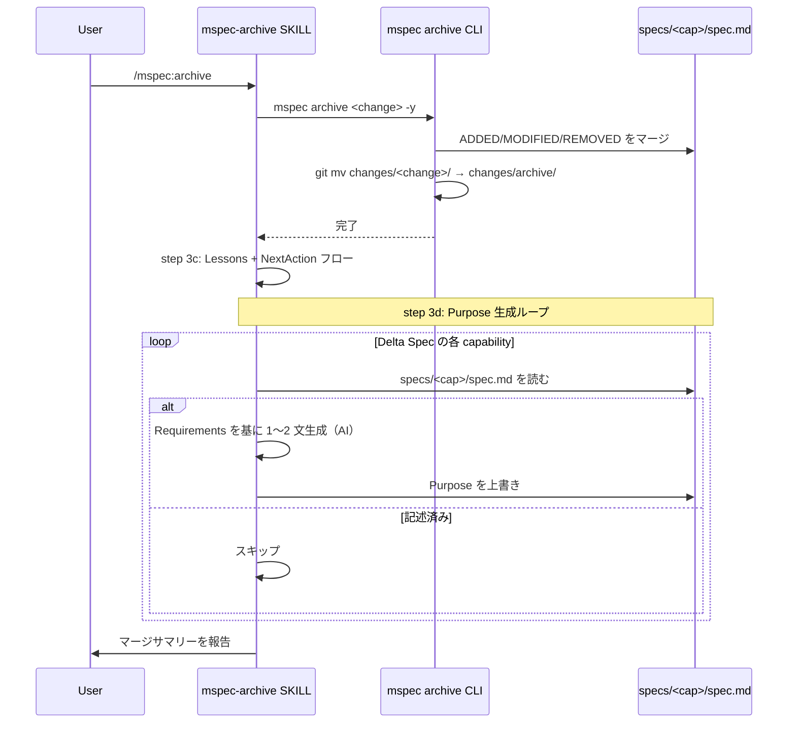
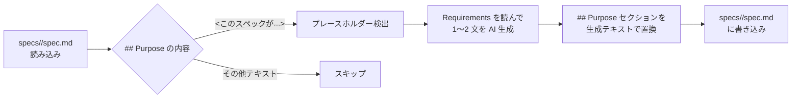

# Architecture Overview: fix-specviewer-purpose-regression

## System Diagram

注意: step 3b は意図的に step 3 より前に配置する（CLI archive が readme.md を validate するため）。

## Sequence Diagram: Purpose 自動生成フロー

## Data Model: Purpose 検出と置換

## 変更ファイル一覧

| ファイル | 種別 | 変更内容 |
|----------|------|----------|
| `.claude/skills/mspec-archive/SKILL.md` | 修正 | step 3c の後に step 3d（Purpose 生成ループ）を追加 |

## Constitution Check

| Principle | Phase 0 | Phase 1 | Notes |
|-----------|---------|---------|-------|
| I. ステップ独立性 | ✅ | ✅ | Purpose 生成は archive 後の独立ステップ。他ステップへの副作用なし |
| II. 決定論的マージ | ✅ | ✅ | CLI 側（LLM フリー）は変更しない。AI 生成は SKILL.md 側のみ |
| III. 質問駆動の要件確定 | ✅ | ✅ | FR-005 に要件明記済み |
| IV. 双方向アンカー | N/A | N/A | コード変更なし |
| V. 強制ステップと拡張ステップの分離 | ✅ | ✅ | 強制ステップ（cli-archive）は変更せず、SKILL.md の拡張ステップに追加 |
| VI. Security by Default | ✅ | ✅ | ローカルファイル書き込みのみ。外部 API・秘密情報アクセスなし |
