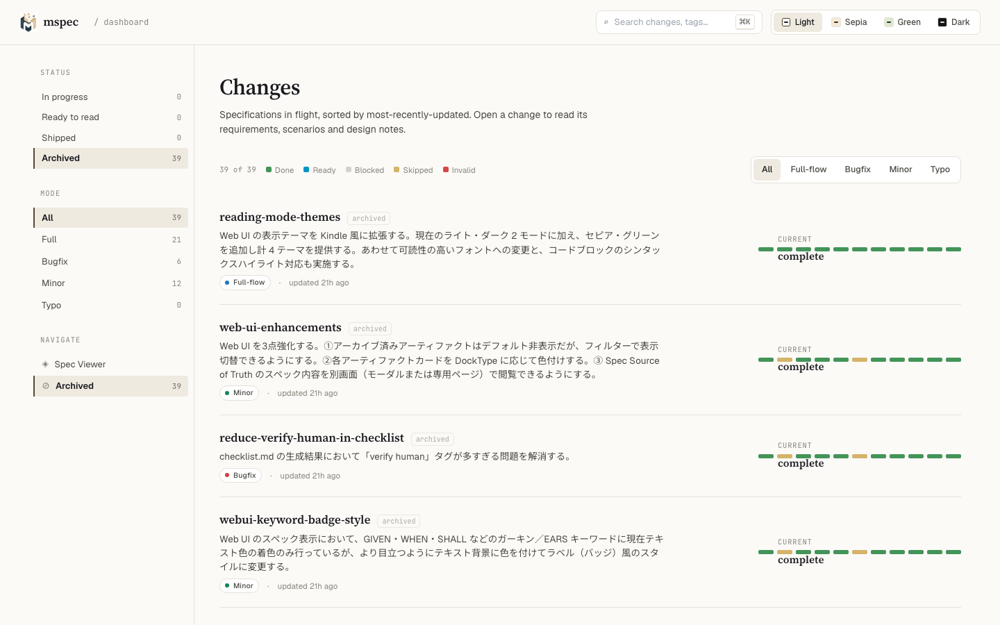
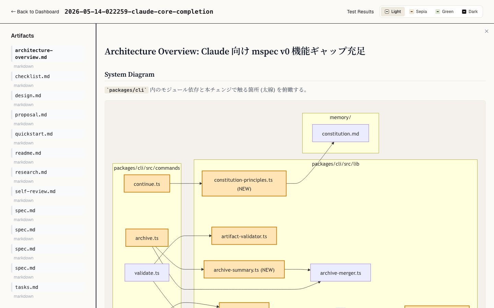
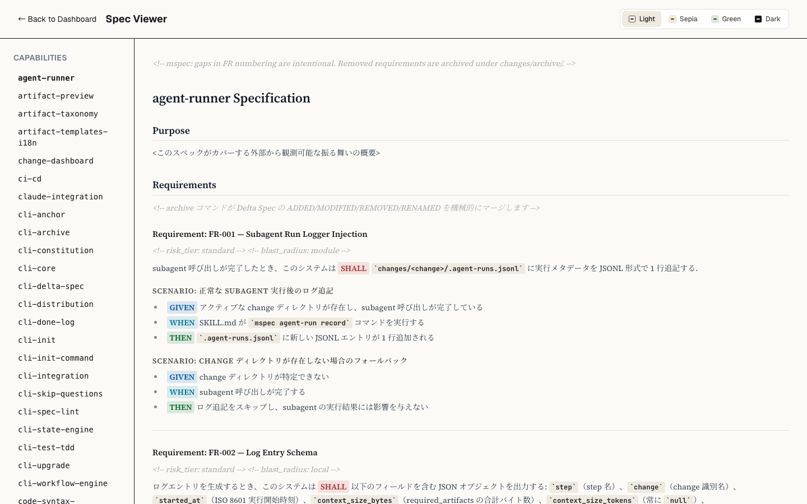
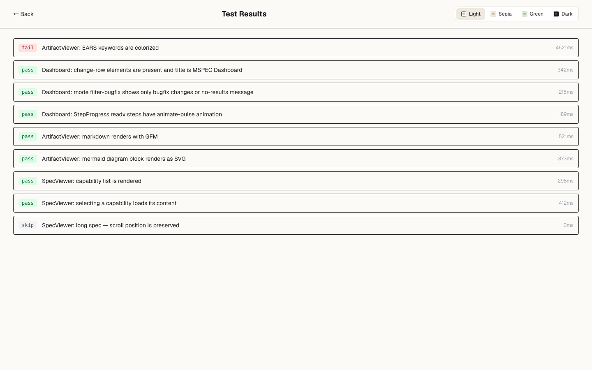
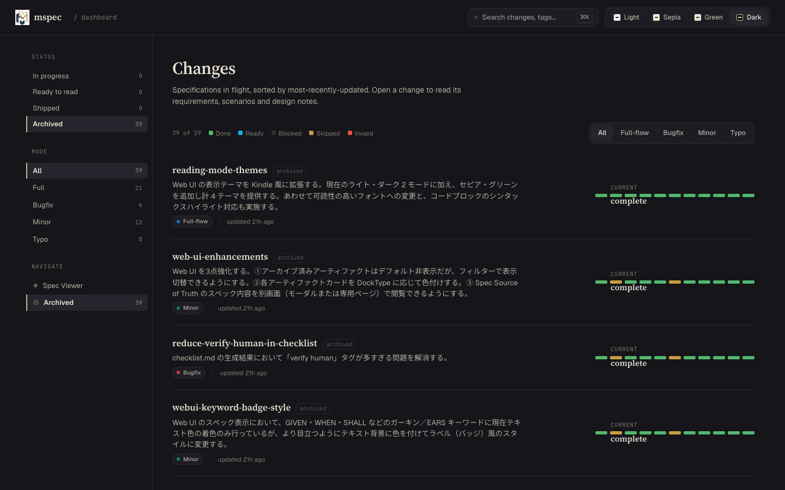

<!-- @mspec-delta 2026-05-24-130128-mspec-web-ui/specs/web-ui-server/spec.md -->
<!-- Requirements implemented: FR-001, FR-002, FR-003 -->
<!-- Change: mspec-web-ui -->

---
doc_type: Tutorial
title: Getting Started with the mspec Web UI
---

# Getting Started with the mspec Web UI

In this tutorial, you will open the mspec Web UI for the first time, navigate each of its pages, and learn what each view is telling you about your changes. By the end, you will be able to use the dashboard to track your workflow, inspect artifacts, read specs, and interpret test results.

**Prerequisites:**
- `mspec init` has been run in your project.
- You have run at least one change through the workflow (e.g., `mspec new my-feature` followed by a few `mspec continue` calls).

---

## 1. Starting the Web UI

The Web UI starts automatically whenever you run `mspec new <feature>` or `mspec continue`. You do not need to take any extra steps — mspec launches the server in the background and prints the URL to your terminal.

If you want to start the server on its own, run:

```bash
mspec continue  # starts the server if not already running, prints the URL
```

Open your browser and navigate to:

```
http://localhost:3847
```

> **Port configuration:** The default port is `3847`. To change it, edit `.mspec/config.yaml` and set the `ui.port` field.

**What you should see:** The mspec dashboard loads with a list of your changes in the main area. If you have run at least one change, at least one row appears.

---

## 2. The Dashboard



The dashboard is your home base. Here is what you are looking at:

### Change list

Each row in the main area represents one change. Left to right, each row shows:

| Element | What it means |
|---|---|
| **Title** | The change name you supplied to `mspec new` |
| **Mode chip** | One of `full`, `bugfix`, `minor`, or `typo` — the scope of the change |
| **Artifact counts** | How many files (proposal, checklist, tasks, design, etc.) exist for this change |
| **Relative timestamp** | When the change was last touched (e.g., "3 minutes ago") |
| **Current step** | Which workflow step is active right now |
| **Step progress bar** | A color-coded strip showing the state of every step |

### Step progress bar colors

The progress bar encodes the state of each workflow step at a glance:

| Color | Meaning |
|---|---|
| Green | Done — the step completed successfully |
| Blue + pulse | Ready — this is the active step, waiting to run |
| Gray | Blocked — prerequisites are not yet met |
| Yellow | Skipped — the step was intentionally bypassed |
| Red | Invalid — the step output failed validation |

### Left sidebar: filters

Use the left sidebar to narrow the list:

- **Status filters** — show only changes in a given state (e.g., in-progress, done, blocked).
- **Mode filters** — show only changes of a specific scope (full, bugfix, minor, typo).

### Search box

Type in the search box at the top of the change list to filter by name, title, summary, or tags. The list updates as you type.

**What you should see:** After applying a filter or typing in the search box, the change list narrows to matching rows only. Clearing the search restores the full list.

---

## 3. Opening a Change

Click any row in the change list to open the **ChangeDetail** view for that change.



### Artifact list

The left panel shows every artifact that belongs to the change. Each artifact has a color-coded left border that tells you its [Diátaxis](https://diataxis.fr/) documentation type:

| Border color | Diátaxis type | Typical artifact |
|---|---|---|
| Blue | Reference | spec, delta spec |
| Purple | Explanation | design rationale, architecture overview |
| Green | How-to | tasks, checklist |
| Yellow | Tutorial | quickstart, tutorial docs |

### Inline split-panel preview

Click any artifact in the left panel to open it in the right panel without leaving the page. The viewer renders:

- **Markdown** with full GitHub Flavored Markdown support (tables, task lists, strikethrough, etc.)
- **Mermaid diagrams** — sequence diagrams, flowcharts, and ER diagrams render as SVG inline.
- **Code blocks** — syntax highlighting for all common languages.
- **EARS / Gherkin keywords** — requirement keywords (`The system shall`, `Given`, `When`, `Then`) are colorized for fast scanning.

**What you should see:** Clicking an artifact splits the view. The left panel stays visible so you can switch between artifacts without losing your place.

---

## 4. Reading a Spec in the Spec Viewer

The **Spec Viewer** lets you browse the source-of-truth spec files for every capability in your project.



To open it, either:

- Click **Spec Viewer** in the top navigation bar from any page, or
- Go directly to `http://localhost:3847/spec-viewer`.

### Navigation

The left sidebar lists every capability that has a spec. Click a capability name to load its spec in the main area. The spec renders with the same full markdown engine used in ChangeDetail — Mermaid diagrams, syntax highlighting, and EARS/Gherkin colorization are all active here too.

**What you should see:** The spec for the capability you selected fills the main area. Mermaid diagrams render as diagrams, not raw text. Requirement keywords appear in color.

---

## 5. Viewing Test Results

From any **ChangeDetail** view, click the **Test Results** button in the header to open the test results panel for that change.



The panel shows every test case that was run for the change, with one of three statuses:

| Status | Badge color |
|---|---|
| Pass | Green |
| Fail | Red |
| Skip | Gray |

Failed test cases sort to the top automatically. Click a failed test to expand it and read the full error message and stack trace inline.

**What you should see:** If all tests pass, you see a green summary at the top and a list of green-badged test cases. If any test failed, it appears at the top with a red badge; clicking it reveals the error details.

---

## 6. Switching Themes

The Web UI ships with four themes. To change the theme, click the **theme picker** in the top-right corner of any page and select one:



| Theme | Character |
|---|---|
| Light | Clean white background, default |
| Sepia | Warm off-white, easy on the eyes for long reading sessions |
| Green | Terminal-inspired green-on-dark |
| Dark | Full dark mode |

Your selection is saved in the browser. The next time you open the Web UI, your chosen theme loads automatically.

**What you should see:** The entire UI — navigation, sidebar, main area — switches to the new theme immediately without a page reload.

---

## Summary

You have now:

1. Started the mspec Web UI and confirmed it is running at `http://localhost:3847`.
2. Used the dashboard to read the change list, filter by status and mode, and interpret step progress bars.
3. Opened a change and used the split-panel artifact viewer to read proposals, specs, and design docs with full Markdown and Mermaid rendering.
4. Navigated to the Spec Viewer to browse source-of-truth specs.
5. Inspected test results and expanded a failed test to read its error trace.
6. Switched the UI theme to match your preference.

From here, explore the rest of the mspec workflow. The Web UI updates in real time as `mspec continue` advances your changes — keep it open in a browser tab while you work to maintain a live overview of your project.
