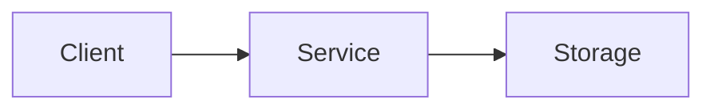
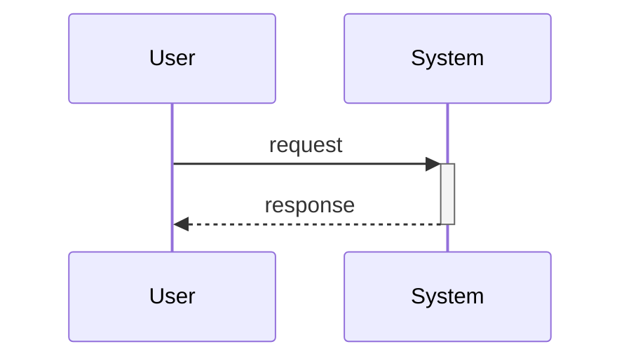
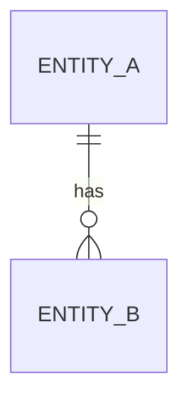

# Architecture Overview: <title>

## System Diagram

## Sequence (if applicable)

## Data Model (if applicable)

## UI Mockup (only if UI changes are involved; SVG preferred)
<inline SVG or PNG link>

## Constitution Check

| Principle | Phase 0 | Phase 1 |
|-----------|---------|---------|
| I. Step Independence | — | — |
| II. Deterministic Merge | — | — |
| III. Question-Driven Requirements | — | — |
| IV. Bidirectional Anchor | — | — |
| V. Mandatory vs Optional Steps | — | — |
