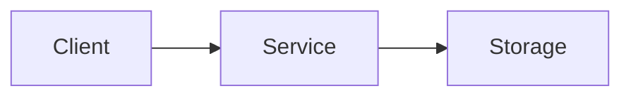
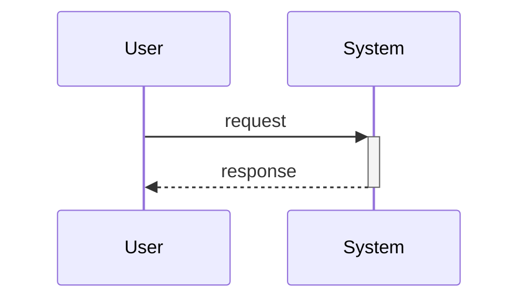
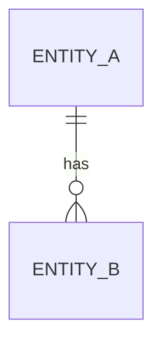

# Architecture Overview: <タイトル>

## System Diagram

```mermaid
graph LR
  A[Client] --> B[Service]
  B --> C[Storage]
```

## Sequence (該当する場合)

```mermaid
sequenceDiagram
  User->>+System: request
  System-->>-User: response
```

## Data Model (該当する場合)

```mermaid
erDiagram
  ENTITY_A ||--o{ ENTITY_B : has
```

## UI Mockup (画面変更がある場合のみ、SVG 推奨)
<inline SVG または PNG リンク>
